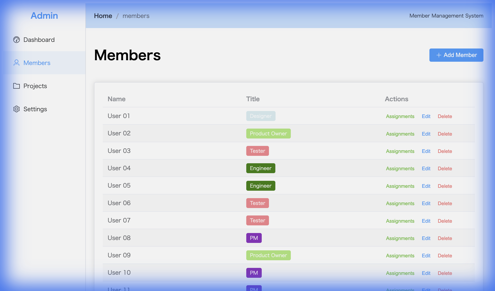
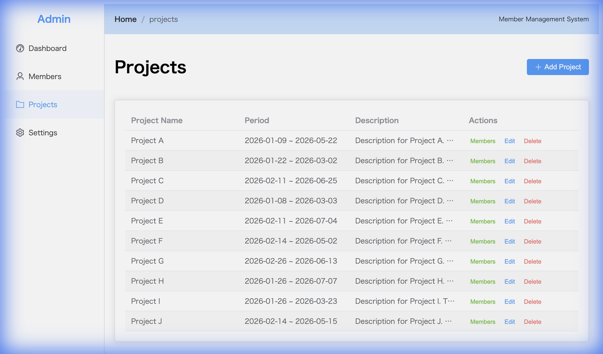

# メンバー管理システム (Member Management System)

チームメンバー、プロジェクト、およびアサイン状況を管理するための包括的なアプリケーションです。タイムラインチャートを備えたビジュアルダッシュボードを特徴としています。

## 目次
- [セットアップ](#セットアップ)
- [使用方法](#使用方法)
    - [ダッシュボード](#ダッシュボード)
    - [メンバー管理](#メンバー管理)
    - [プロジェクト管理](#プロジェクト管理)
    - [設定](#設定)

## セットアップ

### 前提条件
- Docker および Docker Compose

### インストール手順

1.  **リポジトリのクローン:**
    ```bash
    git clone <repository-url>
    cd Antigra
    ```

2.  **Docker Composeを使用してサービスを起動:**
    ```bash
    docker compose up -d --build
    ```

3.  **アプリケーションへのアクセス:**
    ブラウザで [http://localhost:8080](http://localhost:8080) にアクセスしてください。

    *注: フロントエンドはポート8080、バックエンドAPIはポート8000で公開されます。*

### データベースの初期化とデータ投入 (開発用)
データベースは自動的に初期化されます。データをリセットしたり、初期データを投入（シード）したい場合は、以下のコマンドを実行してください：
```bash
docker compose exec backend python seed_data.py
```

## 使用方法

### ダッシュボード
ダッシュボードでは、リソースの割り当て状況やプロジェクトのタイムラインを俯瞰的に確認できます。

#### アサイン・タイムライン (Assignment Timelines)
アサイン状況を時系列で可視化します。2つのビューを切り替えて利用でき、過去から未来までの全期間のデータが自動的に表示されます。

**ユーザービュー (User View):**
特定のユーザーを選択すると、そのユーザーが抱えているプロジェクトのアサイン状況がタイムライン上に表示されます。各バーにはプロジェクト名が重ねて表示され、一目で把握できます。


**プロジェクトビュー (Project View):**
特定のプロジェクトを選択すると、そのプロジェクトにアサインされている全メンバーのタイムラインが表示されます。各バーにはメンバー名が重ねて表示されます。


#### 稼働率チャート
- **メンバー稼働率 (Member Allocation):** 稼働超過（100%超え、赤色）、適正稼働（100%、緑色）、稼働不足（青色）を一目で識別できます。
- **プロジェクトリソース (Project Resources):** プロジェクトごとの総工数（アサイン率の合計）の割合をパイチャートで確認できます。

### メンバー管理 (Members)
チームメンバーの管理を行います。
- 役職（例：マネージャー、エンジニア）を指定して新規メンバーを追加。
- メンバー情報の編集。
- メンバーリストから直接アサイン状況の確認・管理。
- メンバーの削除（関連するアサイン情報も削除されます）。



### プロジェクト管理 (Projects)
プロジェクトの管理を行います。
- 開始日・終了日を指定して新規プロジェクトを作成。
- プロジェクトへのメンバーアサインとアサイン率（工数）の設定。
- プロジェクトのリソース状況の確認。



### 設定 (Settings)
**役職 (Job Titles)** などの設定項目を管理します。
- メンバーに割り当てる役職の追加、編集、削除が可能です。
